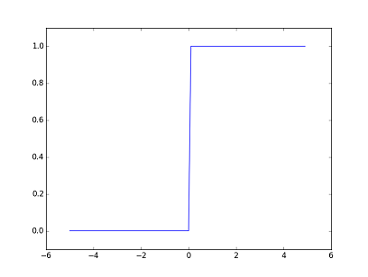
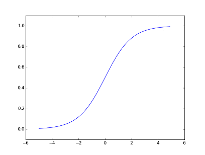
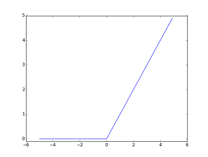

# 3章メモ
---
## 活性化関数
---
### STEP関数
入力が0を超えたら１、それ以外は0

```python
def step_function(x):
    # x > 0 が真偽値を返し、dtypeでintを指定して0と1に変換している
    return np.array(x > 0, dtype=np.int)
```



### sigmoid関数
非線形であることが大事。線形であるばあい、多層のメリットがだせない。

```python
def sigmoid(x):
    return 1 / (1 + np.exp(-x))
```



### ReLU関数
Rectified Linear Unit  

```python
def relu(x):
    return np.maximum(0, x)
```


